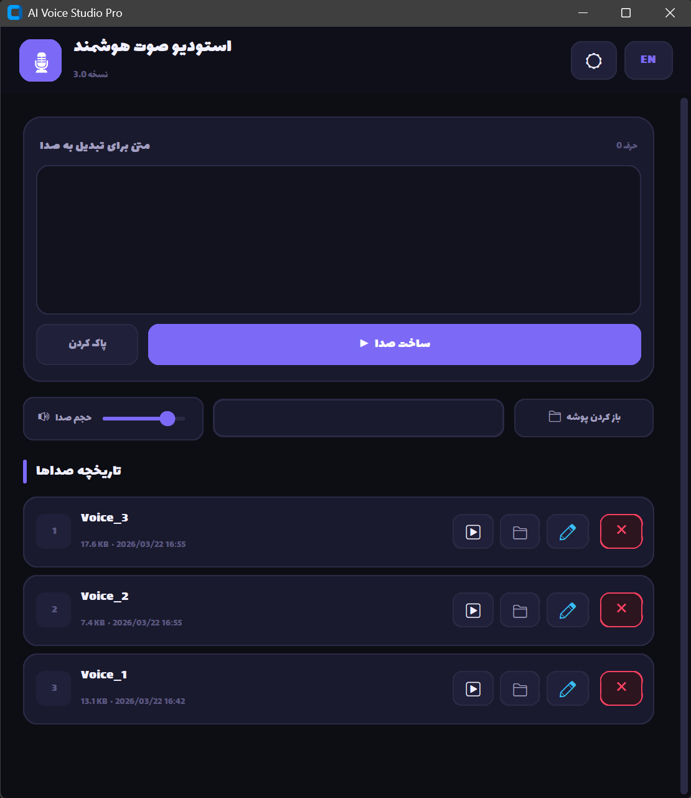
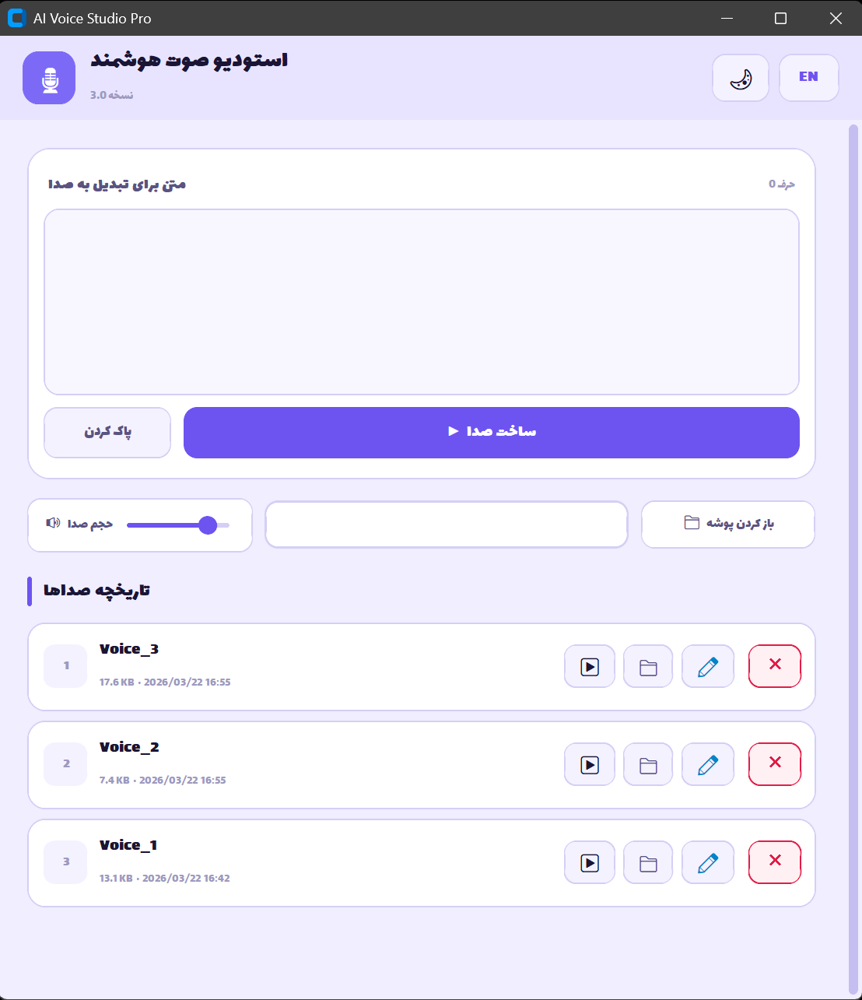

# 🎙️ AI Voice Studio Pro (IranVoiceTTS) V3.0

**استودیو هوشمند تبدیل متن به گفتار فارسی**؛ یک راهکار حرفه‌ای، متن‌باز و High-Performance برای تولید صداهای طبیعی (Human-Like) از متون فارسی با بهره‌گیری از هوش مصنوعی.

-----

## ✨ قابلیت‌های کلیدی (Key Features)

  * **GUI مدرن و صنعتی:** طراحی شده با کتابخانه `CustomTkinter` با ظاهری مینیمال و کاربرپسند، مشابه نرم‌افزارهای تجاری.
  * **تخصصی برای زبان فارسی:** بهینه‌سازی شده برای پردازش متون فارسی و نمایش صحیح با فونت استاندارد **Lalezar**.
  * **مدیریت هوشمند تاریخچه (Surgical Updates):** سیستم به‌روزرسانی جزئی لیست که مانع از کندی برنامه در تعداد فایل‌های بالا می‌شود.
  * **پلیر داخلی پیشرفته (Audio Engine):**
      * پیاده‌سازی شده با `pygame` برای پخش بدون وقفه.
      * **Polling System:** تشخیص خودکار لحظه اتمام صدا و آزاد کردن دکمه‌ها.
      * **Real-time Volume:** کنترل سطح صدا به صورت لحظه‌ای و نرم.
  * **مدیریت فایل Native:** قابلیت **تغییر نام (Rename)** و **حذف (Delete)** فایل‌ها مستقیماً از داخل محیط برنامه بدون نیاز به درگیر شدن با File Explorer ویندوز.
  * **شخصی‌سازی بصری:** \* پشتیبانی کامل از **Dark Mode** و **Light Mode**.
      * سیستم Dynamic Theme برای هماهنگی تمام اجزا با تم انتخابی.
  * **جستجوی آنی (Instant Search):** فیلتر کردن هوشمند فایل‌های تولید شده بر اساس نام یا محتوا در کمترین زمان ممکن.

-----

## 📸 محیط برنامه (Screenshots)

> [\!TIP]
> **برای مشاهده قدرت و زیبایی رابط کاربری، اسکرین‌شات‌های زیر را بررسی کنید:**

| حالت تیره (Dark Mode) | حالت روشن (Light Mode) |
| :---: | :---: |
|  |  |

-----

## ⚙️ پیکربندی و شخصی‌سازی (Configuration)

در فایل `voice_studio_pro.py` می‌توانید پارامترهای زیر را طبق نیاز خود تنظیم کنید:

  * `VOICE_DIR`: مسیر ذخیره‌سازی خروجی‌ها (Default: `voices`).
  * `API_URL`: آدرس سرور پردازشگر صوت.

> [\!CAUTION]
>
> ### 🛑 اخطار بسیار مهم (Important Disclaimer)
>
> **جهت حفظ دسترسی رایگان به سرویس تبدیل متن به گفتار، به هیچ عنوان آدرس `API_URL` را تغییر ندهید. هرگونه تغییر در این آدرس باعث از کار افتادن هسته مرکزی تولید صدای برنامه خواهد شد.**

-----

## 🛠️ پیش‌نیازها و نصب (Installation)

ابتدا مطمئن شوید که پایتون ۳.۸ یا بالاتر روی سیستم شما نصب است، سپس پیش‌نیازها را نصب کنید:

```bash
pip install customtkinter pygame requests pillow
```

*نکته: فایل فونت `Lalezar-Regular.ttf` باید حتماً در پوشه اصلی پروژه قرار داشته باشد تا رابط کاربری به درستی نمایش داده شود.*

## 🚀 راه اندازی سریع

مخزن را کلون کرده و فایل اصلی را اجرا کنید:

```bash
python voice_studio_pro.py
```

-----

## ⚠️ نکات امنیتی

قبل از انتشار عمومی پروژه یا به اشتراک‌گذاری کد، حتماً مقدار `API_TOKEN` را حذف کرده و آن را از طریق **Environment Variables** یا فایل `.env` فراخوانی کنید تا امنیت حساب شما حفظ شود.

-----

## 🤝 مشارکت در توسعه (Contribution)

این پروژه به صورت متن‌باز (Open Source) منتشر شده است. از هرگونه ایده، گزارش باگ یا Pull Request برای بهبود کیفیت پروژه استقبال می‌شود.

-----

**توسعه داده شده با ❤️ توسط Ali1248 (Ali Baba)**
